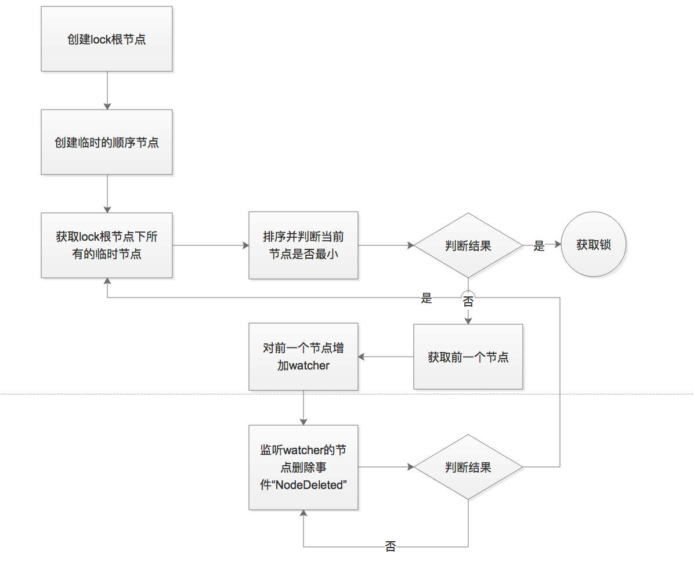

# zookeeper实现分布式锁

## zk存储结构

   * 在lock节点下存储每个节点对应的临时节点数据，按顺序递增。

## 实现流程

   * 首先通过Zookeeper客户端链接zookeeper集群
   * 往zk写临时顺序节点信息。
   * 判断目前的节点是否最小。如果是，获取锁，如果不是，获取前一个次小的节点。
   * 对前一个节点加监听，监听nodedeleted或者Sessionclosed的事件。
   * 后面两种做法：
    
     1、事件触发，返回到第三部。
     2、事件触发，获取锁。本例采用的是这种方式。

## 案例后续优化的点

* 细化事件判断，会存在session断掉的情况。多测试场景覆盖。
* 业务系统中使用，最好加上任务启动的日志记录。防止zookeeper集群挂掉，定时任务没启动，影响整体的业务。说白了就是做冗灾和监控。

## 代码踩坑记

* TaskServiceTest方法在刚开始写的时候，在构造函数中获取connect成员变量，每次都是空的。跟踪代码发现，犯了一个粗心的错误，特记录如下：

可以看到代码中是先实例化对象，再通过AbstractAutowireCapableBeanFactory对象的populateBean方法给属性赋值。所以你在构造函数中获取属性，永远是空的。
